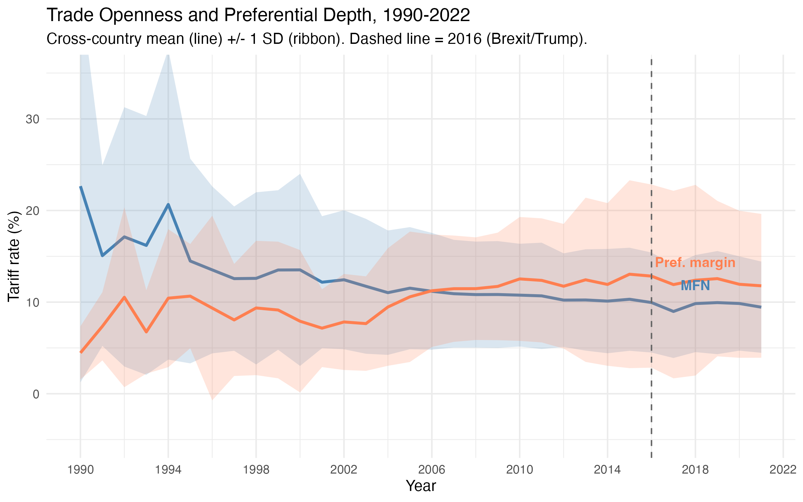
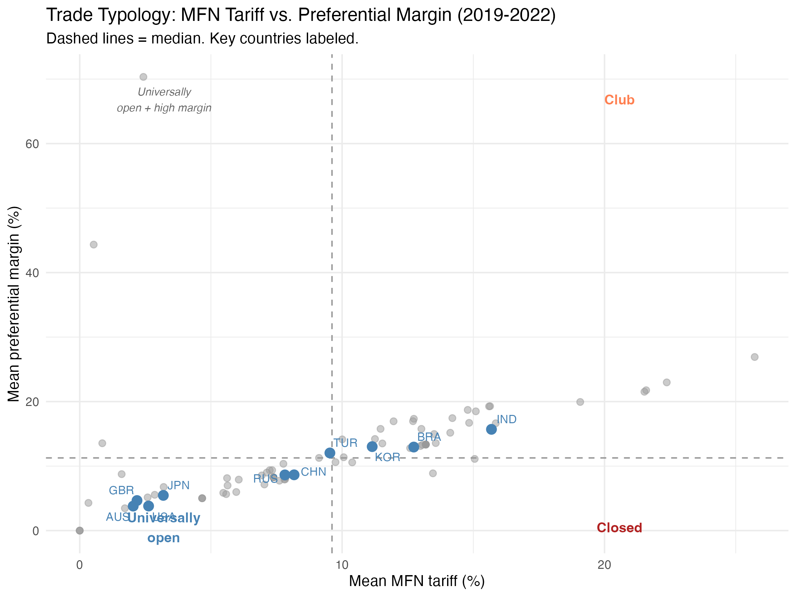

# Introduction

The state of the International Liberal Order (ILO) has become one of the central questions in international relations. A growing literature debates whether the post-Cold War order is in decline (Maull 2018; Cooley and Nexon 2020), undergoing contestation from within and without (Börzel and Zürn 2021), or being reimagined by non-Western actors with alternative visions of legitimate governance (Loh, Paes, and Zarakol 2025). Scholars have documented how populist governments challenge multilateral institutions through voting behavior (Destradi and Vüllers 2024) and how the liberal order's own institutional architecture can become self-undermining (Farrell and Newman 2021).

Yet despite the richness of this theoretical debate, the empirical measurement of ILO support remains underdeveloped. The most common quantitative approach uses UN General Assembly voting patterns to estimate country positions on a liberal-versus-illiberal spectrum (Bailey, Strezhnev, and Voeten 2017). While informative about geopolitical alignment, UNGA votes capture cheap talk --- non-binding resolutions that impose no material costs. An alternative approach uses expert surveys such as V-Dem's liberal democracy indices, which measure domestic institutional quality rather than international commitments.

We argue that the ILO is constituted, in significant part, by the web of international treaties that countries ratify and the trade policies they adopt: bilateral investment treaties, security alliances, environmental agreements, human rights conventions, arms control accords, intellectual property instruments, and tariff regimes. Treaty ratification entails legal obligations, domestic policy adjustments, and reputational stakes. Tariff policy directly reflects a country's openness to the multilateral trading system. A country's pattern of treaty ratification and trade liberalization across these seven domains therefore provides a direct, revealed-preference measure of its engagement with the institutional architecture of the liberal order.

This paper makes three contributions. First, we construct a comprehensive dataset of treaty ratification events across six domains for 206 countries over six five-year periods (1990--2018), complemented by tariff data for a seventh domain (trade) covering 108 countries through 2022. Second, we estimate a two-dimensional dynamic item response theory (IRT) model for each treaty domain, recovering latent ideal points that separate ILO support from domain-specific confounders. For trade, we use directly observed tariff measures --- MFN rates and preferential margins --- that distinguish universally open, club-open, and closed countries. Third, we characterize the aggregate evolution of ILO support, showing that the post-Cold War period is marked not by uniform decline but by increasing differentiation.

# Data

We assemble data from seven domains of international cooperation, each representing a distinct pillar of the ILO. Six domains are measured through treaty ratification; the seventh (trade) is measured directly through tariff data.

## Treaty Sources

Table 1 lists the six treaty-based domains and their primary sources.

**Table 1. Treaty domains and data sources**

| Domain | Source | Treaties | Coverage |
|--------|--------|----------|----------|
| Investment | UNCTAD IIA Navigator | 2,721 BITs | 1959--2018 |
| Security | ATOP 5.1 | 874 alliances | 1815--2018 |
| Environment | IEADB | 1,020 IEAs | 1857--2018 |
| Human Rights | UN Treaty Collection Ch. IV | 18 conventions | 1965--2018 |
| Arms Control | UN Treaty Collection Ch. XXVI + NPT/BWC | 11 treaties | 1968--2018 |
| Intellectual Property | WIPO Lex | 26 treaties | 1883--2018 |

*Notes: Treaty counts refer to unique base treaties (before period expansion). Investment treaties are predominantly bilateral investment treaties. Security alliances are from the Alliance Treaty Obligations and Provisions dataset (Leeds et al. 2002). Environmental agreements are from the International Environmental Agreements Database (Mitchell et al. 2020). Arms control includes the NPT, BWC, CWC, CTBT, Ottawa Convention, and six additional UN Chapter XXVI instruments. Human rights includes 9 core UN conventions and their optional protocols. Intellectual property includes 26 WIPO-administered treaties.*

The six treaty domains differ markedly in their structure. Investment and security are dominated by bilateral agreements, producing thousands of treaty-period items but sparse ratification matrices (most country-treaty pairs are zeros under flow coding). Environment spans both bilateral and large multilateral agreements, yielding the richest dataset. Human rights and arms control consist entirely of large multilateral conventions with near-universal membership, providing the starkest contrasts between early adopters and holdouts.

## Trade Data

Treaty-based measurement is unavailable for trade because the key trade agreements (GATT/WTO, regional FTAs) are too few and heterogeneous to support an IRT model. Instead, we measure trade engagement directly through tariff data from the World Integrated Trade Solution (WITS) database, which draws on UNCTAD's TRAINS (Trade Analysis Information System) dataset.

For each of 108 countries, we collect applied MFN (Most Favored Nation) tariff rates and bilateral preferential tariff rates at the HS 4-digit level for all available years from 1990 to 2022. We then compute two summary measures per country-year:

1. **Mean MFN tariff**: the simple average across 21 HS sections (Harmonized System chapters grouped by WCO classification), giving equal weight to each section.
2. **Mean preferential margin**: for each HS4 product, the margin is defined as the MFN tariff minus the lowest preferential tariff available to any partner; we take the maximum margin across partners for each product, then average across sections.

These two measures capture distinct aspects of trade engagement with the ILO. The MFN tariff reflects a country's general openness to the multilateral trading system --- low MFN tariffs indicate broad liberalization accessible to all trading partners. The preferential margin captures the depth of preferential agreements --- a high margin indicates that the country offers substantially lower tariffs to select partners relative to the MFN baseline. Together, the two measures distinguish three ideal types: *universally open* countries (low MFN, low margin), *club-open* countries (high MFN, high margin), and *closed* countries (high MFN, low margin).

## Flow Coding

For each domain, we construct a binary response matrix $\mathbf{Y}$ of dimension $N \times J$, where $N$ is the number of countries and $J$ is the number of treaty-period items. We employ **flow coding**: a country receives a +1 for a treaty-period item if it newly ratified that treaty during the period, and $-1$ if the treaty was available but the country did not ratify it. Missing values (treaty not yet open, or country not yet independent) are coded as 0 and excluded from the likelihood.

Flow coding captures *new commitments* in each period, providing a dynamic signal of engagement. As a robustness check, we also estimate models under **stock coding**, where a country is coded +1 in all periods during which it is a party to the treaty (Section 5).

Table 2 summarizes the estimation data by domain.

**Table 2. Data summary by issue domain**

| Domain | N | J | Bilateral | Mini (4--10) | Medium (11--50) | Large (51+) |
|--------|:-:|:-:|:---------:|:----------:|:-------------:|:-----------:|
| Investment | 203 | 2,721 | 85.3% | 2.5% | 2.7% | 0.0% |
| Security | 164 | 935 | 89.1% | 3.0% | 2.5% | 0.5% |
| Environment | 206 | 2,857 | 6.1% | 23.8% | 24.7% | 32.9% |
| Human Rights | 197 | 83 | 0.0% | 0.0% | 5.6% | 94.4% |
| Arms Control | 195 | 49 | 0.0% | 0.0% | 0.0% | 100.0% |
| Intellectual Property | 179 | 130 | 0.0% | 3.8% | 23.1% | 73.1% |

*Notes: N = number of countries; J = number of treaty-period items in the flow matrix. Size columns report the share of base treaties by all-time membership: Bilateral = 2 parties; Mini = 4--10; Medium = 11--50; Large = 51+.*

# Model

For the six treaty-based domains, we estimate a two-dimensional dynamic IRT model that recovers latent ideal points from binary ratification data. The trade domain, measured through continuous tariff data, is analyzed descriptively using the MFN and preferential margin measures defined above rather than through a latent variable model. This section describes the IRT specification applied to the treaty domains.

## Two-Dimensional Dynamic IRT

We estimate a two-dimensional dynamic probit IRT model separately for each treaty domain. Let $y_{ij} \in \{+1, -1\}$ denote the observed ratification decision of country $i$ on treaty-period item $j$, and let $s(j) \in \{1, \ldots, T\}$ denote the period associated with item $j$. The observation model is:

$$P(y_{ij} = +1 \mid \mathbf{x}_{i,s(j)}) = \Phi(\alpha_j + \boldsymbol{\beta}_j' \mathbf{x}_{i,s(j)})$$

where $\Phi$ is the standard normal CDF, $\alpha_j$ is the item intercept (difficulty), $\boldsymbol{\beta}_j = (\beta_{j1}, \beta_{j2})'$ is the two-dimensional discrimination vector, and $\mathbf{x}_{it} = (x_{it1}, x_{it2})'$ is the ideal point of country $i$ in period $t$.

Ideal points evolve as a random walk:

$$\mathbf{x}_{i,1} \sim N(\boldsymbol{\mu}_{0i}, \boldsymbol{\Sigma}_{0i}), \qquad \mathbf{x}_{i,t} \mid \mathbf{x}_{i,t-1} \sim N(\mathbf{x}_{i,t-1}, \boldsymbol{\Omega})$$

where $\boldsymbol{\Omega} = \omega^2 \mathbf{I}_2$ governs the smoothness of temporal evolution. We set $\omega^2 = 0.1$ as the baseline, following the convention in the emIRT package (Imai, Lo, and Olmsted 2016), and vary it across a 50-fold range in robustness checks.

## Identification

A $K$-dimensional probit IRT model has $K(K+1)$ degrees of rotational and translational invariance. For $K = 2$, this requires 6 constraints. We achieve identification by fixing the positions of $K + 1 = 3$ anchor countries per domain using tight Gaussian priors ($\sigma = 0.01$). Each anchor provides $K = 2$ constraints, yielding $3 \times 2 = 6$ total constraints.

Anchor countries are selected based on two criteria: (1) the first dimension should capture ILO support, with one anchor at the pro-ILO extreme and one at the anti-ILO extreme, and (2) the third anchor should load on the second dimension, capturing domain-specific variation orthogonal to ILO support. Table 3 reports the anchor configurations.

**Table 3. Anchor countries by domain**

| Domain | Dim 1 (+) | Dim 1 ($-$) | Dim 2 |
|--------|:---------:|:-----------:|:-----:|
| Investment | DNK (+2, 0) | IRN ($-2$, 0) | CHN (0, $-2$) |
| Security | DNK (+2, 0) | IRN ($-2$, 0) | UKR (0, $-2$) |
| Environment | DNK (+2, 0) | SAU ($-2$, 0) | AUS (0, $-2$) |
| Human Rights | DNK (+2, 0) | PRK ($-2$, 0) | USA (0, $-2$) |
| Arms Control | NZL (+2, 0) | ISR ($-2$, 0) | IND (0, $-2$) |
| Intellectual Property | DNK (+2, 0) | AGO ($-2$, 0) | BRA (0, $-2$) |

*Notes: Values in parentheses are the prior means for (dim 1, dim 2). Prior variance is $0.01 \cdot \mathbf{I}_2$ for anchors. Denmark (DNK) anchors dim 1 in 5 of 6 domains, reflecting its consistently high treaty ratification across domains. The dim-2 anchor is domain-specific and chosen to capture the primary confounding dimension (e.g., China for investment captures South-South BIT activity; the USA for human rights captures selective ratification of optional protocols).*

## Estimation

The model is estimated via EM with Albert--Chib data augmentation (Albert and Chib 1993) and a Kalman filter-smoother for the dynamic ideal points. In the E-step, latent utilities $y^*_{ij}$ are drawn from truncated normals conditional on current parameter estimates, and ideal points are updated via a forward-backward Kalman pass. In the M-step, item parameters $(\alpha_j, \boldsymbol{\beta}_j)$ are updated via weighted least squares. Convergence is assessed by monitoring the log-likelihood, with a patience-based stopping rule (5 consecutive iterations with relative change below $10^{-2}$). All models converge in 16--24 iterations.

# Results

## Model Fit

Table 4 reports the percent correctly classified (PCC) for each domain. PCC is computed as $\hat{y}_{ij} = \text{sign}(\alpha_j + \boldsymbol{\beta}_j' \mathbf{x}_{i,s(j)})$ over all non-missing entries.

**Table 4. Classification accuracy (PCC) by domain and dimension**

| Domain | Dim 1 | Dim 2 | Both | Baseline | $n$ |
|--------|:-----:|:-----:|:----:|:--------:|------:|
| Investment | 98.8% | 98.5% | 98.8% | 98.5% | 505,778 |
| Security | 97.6% | 97.6% | 97.8% | 97.4% | 94,001 |
| Environment | 94.6% | 92.2% | 95.8% | 89.9% | 481,335 |
| Human Rights | 87.9% | 87.9% | 89.8% | 84.2% | 11,171 |
| Arms Control | 84.6% | 86.2% | 86.8% | 81.3% | 5,769 |
| Intellectual Property | 92.5% | 92.0% | 93.5% | 91.8% | 16,151 |

*Notes: Baseline = proportion of the modal category. Dim 1 and Dim 2 use only the respective dimension; Both uses the full two-dimensional model.*

The model improves upon the modal baseline in all domains, with the largest gains in environment (+5.9 pp), human rights (+5.6 pp), and arms control (+5.5 pp). The second dimension contributes most in arms control (+2.2 pp over dim 1 alone) and human rights (+1.9 pp), consistent with the expectation that these domains contain confounding structure beyond unidimensional ILO support.

## Ideal Point Estimates

Our quantity of interest is not any individual country's trajectory but rather the aggregate distribution of latent positions across periods, which captures systemic-level shifts in support for the ILO.

### Investment

The investment domain (Figure 1) shows a steady rightward shift in the distribution of dim-1 ideal points from 1990--1994 (mean = 0.97) to 2015--2018 (mean = 1.44), reflecting the expansion of the bilateral investment treaty network. The spread also increases (sd from 1.74 to 2.06), indicating growing heterogeneity. Tax havens and offshore financial centers tend to cluster in the high-dim-1 region, consistent with their role as active BIT signatories.

### Security

The security domain (Figure 2) exhibits a leftward drift in dim-1 means (from $-0.78$ to $-1.10$), suggesting that the distribution of alliance commitments has shifted away from the ILO-support pole. Nuclear powers occupy a range of positions along both dimensions, reflecting the diversity of their alliance portfolios.

### Environment

The environment domain (Figure 3), with the largest item set ($J = 2{,}857$), shows relatively stable dim-1 means (ranging from $-0.70$ to $-0.58$) but a clear downward shift in dim-2 means (from $-0.44$ to $-0.81$). The increasing spread on both dimensions indicates growing polarization in environmental treaty engagement.

### Human Rights

In the human rights domain (Figure 4), the distribution is approximately centered (dim-1 mean near zero across all periods), with gradually increasing dispersion (sd from 1.00 to 1.23). This pattern reflects the near-universal ratification of core human rights treaties combined with selective ratification of optional protocols and newer instruments. The USA, anchoring dim-2, is positioned distinctly from countries that have ratified the full suite.

### Arms Control

The arms control domain (Figure 5) includes 11 treaties, from the NPT (191 parties) to the Treaty on the Prohibition of Nuclear Weapons (69 parties). Dim-1 means hover near zero throughout the study period, but the distribution compresses from 1990--1994 (sd = 0.82) to 1995--1999 (sd = 0.51) before slowly widening. This compression coincides with the wave of post-Cold War accessions to the CWC, CTBT, and Ottawa Convention.

### Intellectual Property

The intellectual property domain (Figure 6) shows a leftward drift in dim-1 means (from $-0.08$ to $-0.31$), reflecting the rapid expansion of WIPO treaty membership after the TRIPS Agreement. The spread increases substantially (sd from 0.95 to 1.30), indicating growing differentiation as some countries adopt the full suite of WIPO-administered treaties while others remain selective.

### Trade

Unlike the six treaty-based domains, trade is measured directly through tariff data from the WITS/TRAINS database, covering 108 countries from 1990 to 2022. We construct two summary measures for each country-year: (1) the mean MFN (Most Favored Nation) applied tariff, averaged across 21 HS sections, and (2) the mean preferential margin, defined as the difference between the MFN tariff and the best preferential tariff available to any partner, averaged across sections. Together, these two measures distinguish three ideal types of trade engagement: *universally open* countries (low MFN, low margin), *club* countries (high MFN, high margin --- open to preferential partners but not to the world), and *closed* countries (high MFN, low margin).

Figure 7 shows the evolution of these two measures. The cross-country mean MFN tariff falls steadily from 17.8% in 1990--1994 to 9.5% in 2019--2022, reflecting three decades of multilateral and unilateral liberalization. The cross-country dispersion also compresses (sd from 18.3% to 5.8%), indicating convergence toward lower tariffs. Meanwhile, the mean preferential margin rises from 9.2% to 12.3%, reflecting the proliferation of preferential trade agreements. The dispersion of margins *increases* (sd from 6.8% to 9.2%), indicating growing differentiation in preferential depth.

Figure 8 plots MFN tariffs against preferential margins for the 2019--2022 period, revealing the three-type structure. The USA, Japan, Australia, and the UK cluster in the lower-left quadrant (universally open: low MFN, low margin). India, Brazil, Korea, and Turkey occupy the upper-right (club: high MFN, high preferential depth through regional agreements like MERCOSUR and RCEP). Few countries occupy the lower-right (closed: high MFN, low margin), reflecting the near-universality of preferential agreements in the modern trade system.

Figure 9 shows MFN trajectories for selected countries. India and China exhibit the most dramatic liberalization (India from 68% to 14%; China from 41% to 8%), though India's tariffs have *risen* since 2018 --- one of the few cases of sustained MFN reversal in the dataset. The 2016 mark (Brexit/Trump) does not produce a visible aggregate break in MFN tariffs, likely because tariff increases under Trump were targeted (specific products and partners) rather than across-the-board.

## Aggregate Trends

Table 5 summarizes the temporal evolution of dim-1 ideal points across all six domains.

**Table 5. Aggregate trends in dim-1 (ILO support), 1990--1994 vs. 2015--2018**

| Domain | Mean (1990--94) | SD (1990--94) | Mean (2015--18) | SD (2015--18) | Trend |
|--------|:-:|:-:|:-:|:-:|:---:|
| Investment | +0.97 | 1.74 | +1.44 | 2.06 | $\nearrow$ |
| Security | $-0.78$ | 1.68 | $-1.10$ | 1.84 | $\searrow$ |
| Environment | $-0.70$ | 1.51 | $-0.58$ | 1.98 | $\approx$ |
| Human Rights | $-0.01$ | 1.00 | $-0.04$ | 1.23 | $\approx$ |
| Arms Control | +0.07 | 0.82 | +0.01 | 0.59 | $\approx$ |
| Intellectual Property | $-0.08$ | 0.95 | $-0.31$ | 1.30 | $\searrow$ |
| Trade (MFN tariff) | 17.8% | 18.3% | 9.5% | 5.8% | $\nearrow$ (liberalization) |
| Trade (Pref. margin) | 9.2% | 6.8% | 12.3% | 9.2% | $\nearrow$ (more preferences) |

*Notes: Trend arrows: $\nearrow$ = increasing ILO support, $\searrow$ = decreasing, $\approx$ = approximately stable. Trade rows report raw tariff rates (not latent ideal points); the trade period comparison uses 1990--1994 vs. 2019--2022.*

Three broad patterns emerge. First, the investment domain shows the clearest evidence of expanding ILO support, driven by the proliferation of bilateral investment treaties throughout the 1990s and 2000s. Second, security shows a drift away from the ILO-support pole, potentially reflecting the fragmentation of alliance structures after the Cold War. Third, the remaining domains show relatively stable means but increasing dispersion, suggesting that while the average level of treaty engagement has remained roughly constant, countries have become more differentiated in their commitment patterns.

The most striking finding is that the standard deviation of dim-1 ideal points increases over time in five of six domains (arms control is the exception, where post-Cold War convergence dominates). This growing heterogeneity suggests that the ILO is not experiencing uniform erosion or uniform deepening, but rather increasing differentiation --- a pattern consistent with the "contested multilateralism" thesis of Börzel and Zürn (2021).

## External Validation

To assess whether our treaty-based ideal points capture meaningful variation, we correlate dim-1 estimates with two external measures: UNGA ideal points (Bailey, Strezhnev, and Voeten 2017) and V-Dem's liberal democracy index (Coppedge et al. 2023). Table 6 reports pooled Pearson correlations across all country-period observations.

**Table 6. External validation: correlation with UNGA and V-Dem**

| Domain | $r$ (UNGA) | $r$ (V-Dem) | $N$ |
|--------|:----------:|:-----------:|:---:|
| Environment | 0.53 | **0.68** | 1,124 |
| Intellectual Property | **0.52** | 0.46 | 1,041 |
| Security | 0.43 | **0.52** | 969 |
| Arms Control | 0.33 | **0.43** | 1,118 |
| Human Rights | $-0.16$ | $-0.29$ | 1,130 |
| Investment | 0.09 | 0.03 | 1,013 |

*Notes: Bold indicates the stronger external correlate. Correlations computed over all non-missing country-period pairs.*

Four of six domains show moderate-to-strong UNGA alignment ($|r| > 0.3$). V-Dem correlates more strongly than UNGA in three domains (environment, security, arms control), suggesting that dim-1 partially captures domestic liberalism alongside international alignment. Intellectual property is the exception: UNGA outperforms V-Dem ($r = 0.52$ vs. $0.46$), consistent with IP treaty participation tracking geopolitical alignment more than regime type. Investment shows near-zero correlation with both, reflecting the economic rather than political logic of BIT networks. Human rights shows a negative correlation, suggesting that the model's first dimension captures a different aspect of engagement than what UNGA votes or liberal democracy scores measure --- possibly the distinction between rhetorical commitment (UNGA votes) and institutional selectivity (optional protocol ratification).

# Robustness

We conduct five robustness checks to assess the sensitivity of our results to modeling choices. We summarize each briefly; full results are available in the supplementary materials.

## R1: Stock Coding

Under stock coding, a country is coded as a party (+1) in all periods after initial ratification, rather than only in the period of ratification. This addresses the concern that flow coding creates an "activity bias" whereby long-standing members of treaties appear less committed in later periods because they have exhausted the treaty space.

Stock coding produces robust results for investment (trivially, since most BITs are single-period events) and environment ($r > 0.96$ across all periods). However, it reverses temporal trends in four of six domains (security, arms control, IP, and human rights). This finding validates the activity bias concern: under stock coding, early adopters accumulate high scores, masking meaningful temporal variation in new commitments. We retain flow coding as the baseline because it better captures the dynamic signal of ongoing engagement, while reporting stock results for completeness.

## R2: Alternative Country Anchors

We re-estimate each domain with two alternative sets of anchor countries, drawn from PCA extremes and theoretically motivated alternatives. Investment is highly robust ($r > 0.99$ across both alternative sets). Environment and intellectual property are robust ($r > 0.93$). Security is mostly robust ($r > 0.95$ for one set, $r = 0.96$ for the other). Human rights and arms control show greater sensitivity ($r$ as low as $-0.87$ for HR with one alternative set), reflecting the challenge of identifying a consistent ILO-support dimension in domains with high treaty universality. Cross-sectional rankings are more stable than temporal trends.

## R3: Item Anchor Sensitivity

We verify that theoretically motivated anchor items (e.g., NPT and CTBT for arms control, ICCPR for human rights) have the expected positive discrimination signs. In environment, arms control, and IP, all theory items have positive $\beta_1$ in the baseline model. Human rights shows a sign mismatch for one theory item, consistent with the identification challenges noted above. Constraining item start values to have positive $\beta_1$ produces ideal points that correlate at $r > 0.98$ with the baseline in five of six domains, with security as the outlier ($r = 0.79$).

## R4: Evolution Variance ($\omega^2$) Sensitivity

We vary $\omega^2$ across a 50-fold range (0.01 to 0.5). All domains maintain $r > 0.97$ with the baseline for the moderate range ($\omega^2 \in [0.01, 0.2]$), and $r > 0.80$ even at the extreme $\omega^2 = 0.5$. Trend directions are preserved across all values. We conclude that $\omega^2 = 0.1$ is a safe default that does not drive substantive conclusions.

## R5: Three-Year Temporal Windows

We re-estimate all models using 10 three-year periods (1990--1992 through 2017--2018) instead of 6 five-year periods. Investment, security, and IP show strong trend preservation ($r > 0.97$). Environment is moderately robust (trend $r = 0.82$). Human rights shows essentially zero trend correlation ($r = 0.08$), reflecting the near-zero trend in both specifications. Arms control shows a trend reversal ($r = -0.61$), likely driven by the extreme sparsity of the domain ($J = 38$ items under three-year windows) combined with the sensitivity of the first-period estimates. The sparse domains (HR, arms control) are most sensitive to temporal resolution, while the data-rich domains remain stable.

# Discussion

Our results speak to three themes in the literature on the liberal international order.

**Not decline, but differentiation.** The dominant narrative frames the ILO as being in decline or crisis (Maull 2018; Cooley and Nexon 2020). Our results paint a more nuanced picture. Only the security domain shows a clear drift away from the ILO-support pole. Investment shows deepening. The remaining domains show stable means but increasing dispersion. This pattern is more consistent with Börzel and Zürn's (2021) framework of "contestation" --- the order is not collapsing but becoming more heterogeneous, with growing gaps between countries that embrace the full institutional architecture and those that selectively engage.

**Domain-specific dynamics.** The ILO is not a monolith. Investment treaty networks follow economic logic (near-zero correlation with UNGA and V-Dem), security alliances track geopolitical alignment, and environmental agreements correlate strongly with both international alignment and domestic liberalism. These domain-specific dynamics are obscured in unidimensional measures. As Farrell and Newman (2021) argue, different institutional domains of the liberal order can evolve in contradictory directions, and our domain-specific measurement strategy is designed to capture precisely this heterogeneity.

**Measurement as contested ground.** Our finding that human rights ideal points are negatively correlated with UNGA votes and liberal democracy scores is provocative. It suggests that treaty-based measurement captures something distinct from what these established measures track --- perhaps the gap between rhetorical alignment (UNGA votes for human rights resolutions) and institutional commitment (ratifying optional protocols with enforcement mechanisms). As Loh, Paes, and Zarakol (2025) emphasize, what counts as "supporting" the liberal order depends on whose vision of the order one adopts. Treaty ratification may measure adherence to the institutional architecture more than alignment with the norms it ostensibly embodies.

**Limitations.** Several caveats apply. First, treaty ratification is an imperfect proxy for actual compliance. Countries may ratify treaties without implementing them, and some may comply without ratifying. Second, our flow coding privileges recent activity, potentially underweighting the commitments of long-standing participants. Stock coding addresses this concern but introduces its own biases. Third, the per-domain estimation strategy does not pool information across domains, precluding direct estimation of cross-domain correlations. Fourth, the trade domain uses directly observed tariff rates rather than the IRT framework applied to the other domains, precluding direct comparability of trade and treaty-based measures on a common latent scale. Fifth, the human rights and arms control domains show identification sensitivity in several robustness checks, suggesting that the two-dimensional model may not fully capture the complexity of ratification patterns in these domains.

# Conclusion

We have proposed and implemented a measurement strategy for support for the International Liberal Order based on treaty ratification across six domains and tariff data for a seventh. Using a two-dimensional dynamic IRT model for the treaty domains and directly observed tariff measures for trade, we recover latent ideal points and policy indicators that capture systemic-level shifts in institutional commitment from 1990 to 2022. Our central finding --- increasing heterogeneity across all domains --- offers a quantitative counterpoint to both optimistic and pessimistic narratives about the order's trajectory. The trade domain reinforces this picture: while MFN tariffs have converged downward, preferential margins have diverged, reflecting a shift from multilateral to club-based liberalization. The ILO is not dying; it is differentiating.

# References

Albert, James H., and Siddhartha Chib. 1993. "Bayesian Analysis of Binary and Polychotomous Response Data." *Journal of the American Statistical Association* 88(422): 669--679.

Bailey, Michael A., Anton Strezhnev, and Erik Voeten. 2017. "Estimating Dynamic State Preferences from United Nations Voting Data." *Journal of Conflict Resolution* 61(2): 430--456.

Börzel, Tanja A., and Michael Zürn. 2021. "Contestations of the Liberal International Order: From Liberal Multilateralism to Postnational Liberalism." *International Organization* 75(2): 282--305.

Cooley, Alexander, and Daniel Nexon. 2020. *Exit from Hegemony: The Unraveling of the American Global Order*. Oxford University Press.

Coppedge, Michael, et al. 2023. *V-Dem Codebook v13*. Varieties of Democracy (V-Dem) Project.

Destradi, Sandra, and Johannes Vüllers. 2024. "Populism and the Liberal International Order: An Analysis of UN Voting Patterns." *The Review of International Organizations*: 1--28.

Farrell, Henry, and Abraham L. Newman. 2021. "The Janus Face of the Liberal International Information Order: When Global Institutions Are Self-Undermining." *International Organization* 75(2): 333--358.

Imai, Kosuke, James Lo, and Jonathan Olmsted. 2016. "Fast Estimation of Ideal Points with Massive Data." *American Political Science Review* 110(4): 631--656.

Leeds, Brett Ashley, Jeffrey M. Ritter, Sara McLaughlin Mitchell, and Andrew G. Long. 2002. "Alliance Treaty Obligations and Provisions, 1815--1944." *International Interactions* 28(3): 237--260.

Loh, Dylan M. H., Lucas De Oliveira Paes, and Ayşe Zarakol. 2025. "Non-Western Visions of International Order." *Annual Review of Political Science*.

Martin, Andrew D., and Kevin M. Quinn. 2002. "Dynamic Ideal Point Estimation via Markov Chain Monte Carlo for the U.S. Supreme Court, 1953--1999." *Political Analysis* 10(2): 134--153.

Maull, Hanns W., ed. 2018. *The Rise and Decline of the Post-Cold War International Order*. Oxford University Press.

Mitchell, Ronald B., et al. 2020. "What We Know (and Could Know) About International Environmental Agreements." *Global Environmental Politics* 20(1): 103--121.
