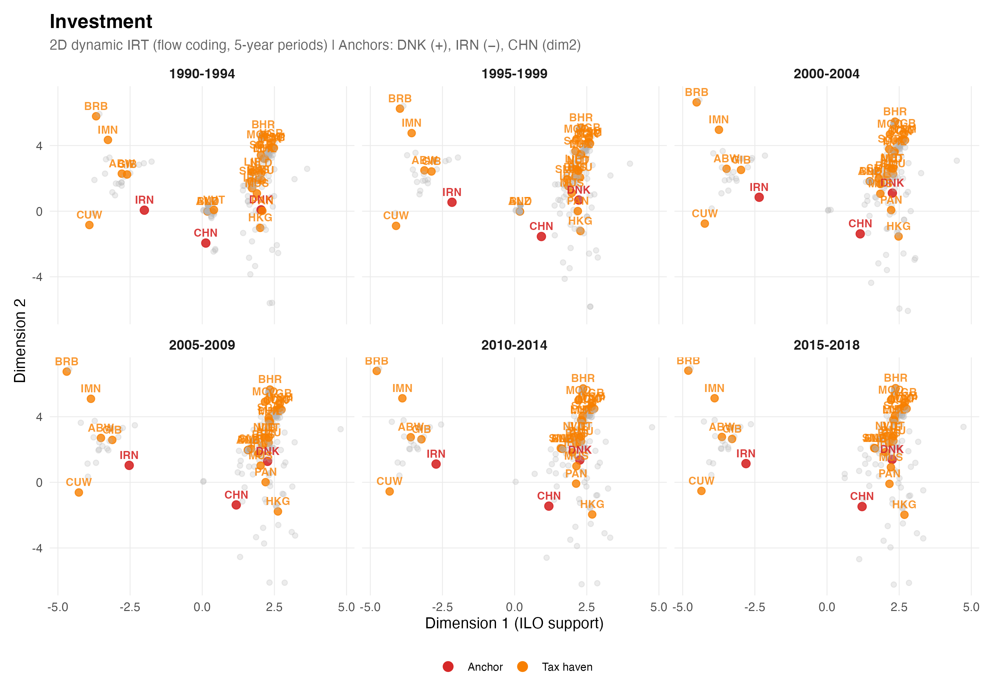
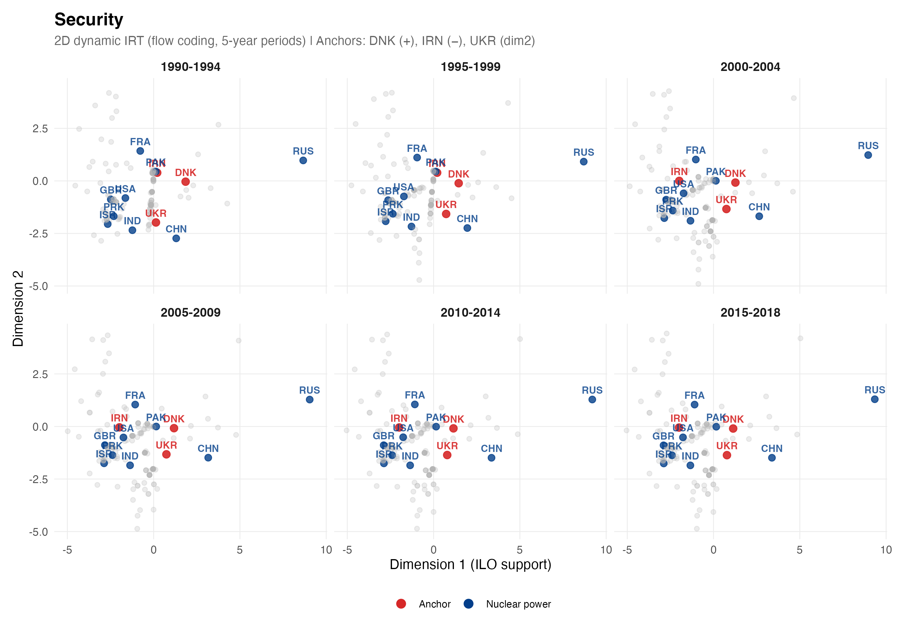
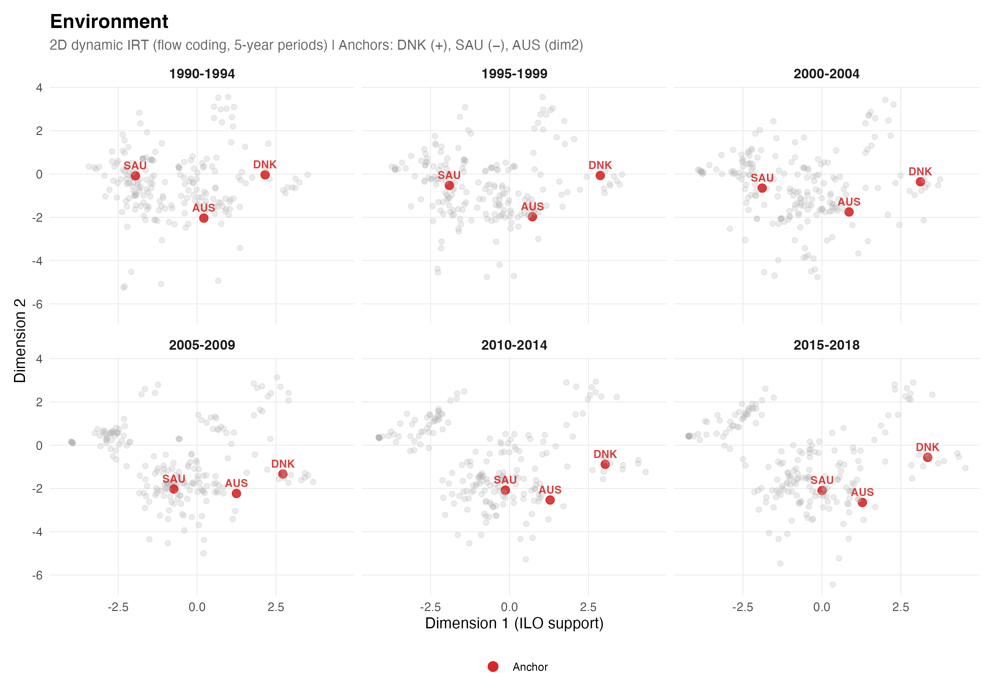
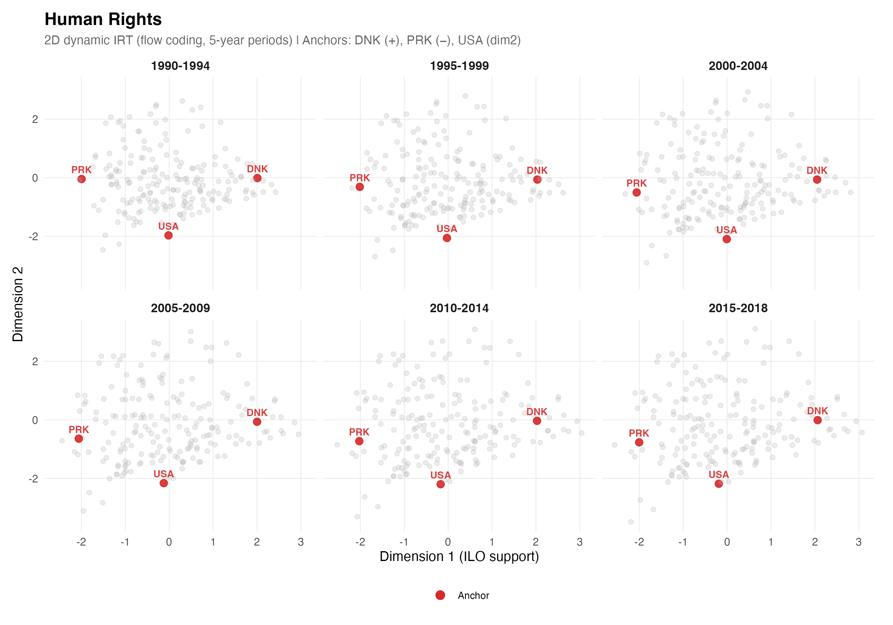
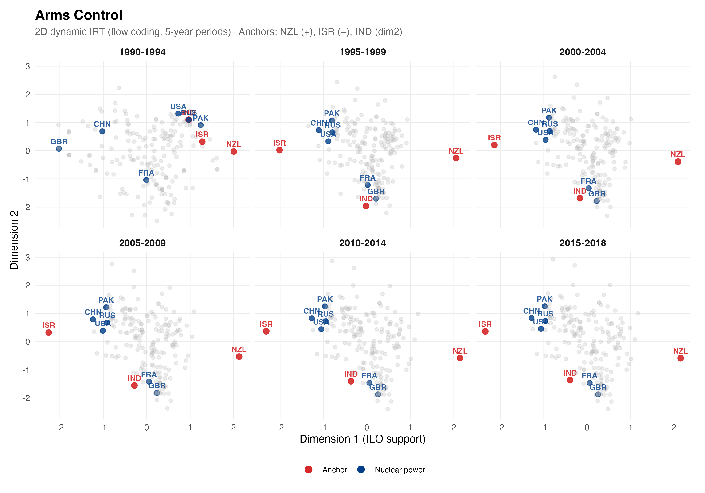
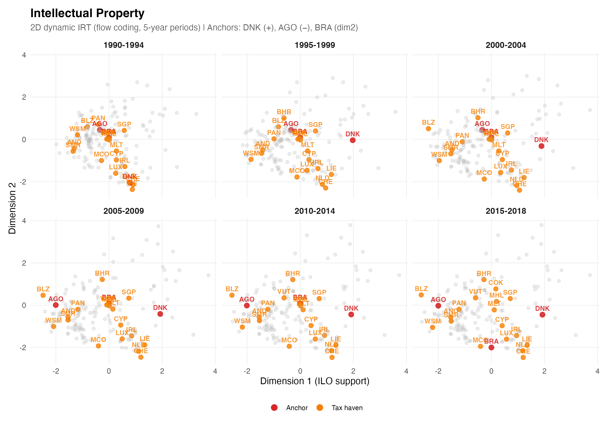

# Results

## Data

We estimate support for the International Liberal Order across six issue domains using treaty ratification data from 1990 to 2018, divided into six five-year periods. Table 1 summarizes the data for each domain, including the number of countries, treaty-period items, and the composition of the treaty universe by size.

**Table 1. Data summary by issue domain**

| Domain | N | J | Treaties | Bilateral | Mini (4--10) | Medium (11--50) | Large (51+) |
|--------|:-:|:-:|:--------:|:---------:|:----------:|:-------------:|:-----------:|
| Investment | 203 | 2,721 | 2,721 | 85.3% | 2.5% | 2.7% | 0.0% |
| Security | 164 | 935 | 874 | 89.1% | 3.0% | 2.5% | 0.5% |
| Environment | 206 | 2,857 | 1,020 | 6.1% | 23.8% | 24.7% | 32.9% |
| Human Rights | 197 | 83 | 18 | 0.0% | 0.0% | 5.6% | 94.4% |
| Arms Control | 195 | 49 | 11 | 0.0% | 0.0% | 0.0% | 100.0% |
| Intellectual Property | 179 | 130 | 26 | 0.0% | 3.8% | 23.1% | 73.1% |

*Notes: N = number of countries; J = number of treaty-period items in the flow matrix. Treaties = number of unique base treaties (before period expansion). Size columns report the share of base treaties by all-time country participation (stock): Bilateral = 2 parties; Mini = 4--10; Medium = 11--50; Large = 51+. Residual shares (1 country and trilateral) are omitted. Investment treaties are predominantly bilateral investment treaties (BITs); security treaties are bilateral and multilateral defense alliances (ATOP). Arms control includes NPT (191 parties), BWC (188), CWC (193), CTBT (178), Ottawa Convention (162), and six additional treaties. Human rights includes 18 UN human rights conventions (CRC, CEDAW, ICCPR, ICESCR, CAT, CRPD, and their protocols). Intellectual property includes 26 WIPO-administered treaties.*

The six domains differ markedly in their treaty structure. Investment and security are dominated by bilateral agreements --- bilateral investment treaties and defense alliances, respectively --- producing thousands of treaty-period items but limited variation per item (most country-treaty pairs are non-ratification under flow coding). Environment spans both bilateral and large multilateral agreements, yielding the richest dataset. Human rights and arms control consist entirely of large multilateral conventions with near-universal membership, providing the starkest contrasts between ratifiers and non-ratifiers.

## Model Fit

Table 2 reports the percent correctly classified (PCC) for each domain, decomposed by dimension. The PCC measures the share of observed ratification decisions that the model predicts correctly, computed as $\hat{y}_{ij} = \text{sign}(\alpha_j + \boldsymbol{\beta}_j' \mathbf{x}_{i,s(j)})$.

**Table 2. Classification accuracy (PCC) by domain and dimension**

| Domain | Dim 1 | Dim 2 | Both | Baseline | n |
|--------|:-----:|:-----:|:----:|:--------:|------:|
| Investment | 98.8% | 98.5% | 98.8% | 98.5% | 505,778 |
| Security | 97.6% | 97.6% | 97.8% | 97.4% | 94,001 |
| Environment | 94.6% | 92.2% | 95.8% | 89.9% | 481,335 |
| Human Rights | 87.9% | 87.9% | 89.8% | 84.2% | 11,171 |
| Arms Control | 84.6% | 86.2% | 86.8% | 81.3% | 5,769 |
| Intellectual Property | 92.5% | 92.0% | 93.5% | 91.8% | 16,151 |

*Notes: Baseline = modal category (proportion of the most frequent response). PCC computed over all non-missing country-item pairs. Dim 1 uses only the first-dimension ideal points; Dim 2 uses only the second; Both uses the full two-dimensional model.*

The model improves upon the modal baseline in all domains, with the largest gains in environment (+5.9 percentage points), human rights (+5.6 pp), and arms control (+5.5 pp). For investment and security, the near-ceiling baselines (98.5% and 97.4%) leave limited room for improvement, reflecting the sparsity of bilateral treaty data under flow coding. The second dimension contributes meaningfully in arms control (+2.2 pp over dim 1 alone) and human rights (+1.9 pp), consistent with the expectation that these domains have confounding structure beyond unidimensional ILO support.

## Ideal Point Estimates

We now turn to the estimated ideal points. Our quantity of interest is not any individual country's trajectory but rather the aggregate distribution of latent positions across periods, which captures systemic-level shifts in support for the ILO.

### Investment

The investment domain (Figure 1) shows a steady rightward shift in the distribution of dim-1 ideal points from 1990--1994 (mean = 0.97) to 2015--2018 (mean = 1.44), reflecting the expansion of the bilateral investment treaty network. The spread also increases (sd from 1.74 to 2.06), indicating growing heterogeneity. Denmark anchors the pro-ILO end, Iran the anti-ILO end, and China anchors the second dimension, which captures variation in treaty engagement orthogonal to ILO support. Tax havens and offshore financial centers (highlighted in Figure 1) tend to cluster in the high-dim-1 region, consistent with their role as active BIT signatories.

### Security

The security domain (Figure 2) exhibits a leftward drift in dim-1 means (from $-0.78$ to $-1.10$), suggesting that the distribution of alliance commitments has shifted away from the ILO-support pole over the study period. Nuclear powers (highlighted in Figure 2) occupy a range of positions along both dimensions, reflecting the diversity of their alliance portfolios.

### Environment

The environment domain (Figure 3), with the largest item set (J = 2,857), shows relatively stable dim-1 means (ranging from $-0.70$ to $-0.58$) but a clear downward shift in dim-2 means (from $-0.44$ to $-0.81$). The increasing spread on both dimensions (dim-1 sd from 1.51 to 1.98; dim-2 sd from 1.43 to 1.77) indicates growing polarization in environmental treaty engagement. The environment domain achieves the highest classification accuracy among the multilateral-treaty domains (PCC = 95.8%), reflecting strong signal in environmental treaty ratification patterns.

### Human Rights

In the human rights domain (Figure 4), the distribution is approximately centered (dim-1 mean near zero across all periods), with gradually increasing dispersion (sd from 1.00 to 1.23). This pattern reflects the near-universal ratification of core human rights treaties (CRC has 196 parties) combined with selective ratification of optional protocols and newer instruments, which drives the differentiation among countries. The USA, anchoring dim-2, is positioned distinctly from countries that have ratified the full suite of human rights treaties.

### Arms Control

The arms control domain (Figure 5) now includes 11 treaties --- adding the NPT (191 parties), BWC (188 parties), and ENMOD (78 parties) to the original UN Treaty Collection Chapter XXVI treaties. Dim-1 means hover near zero throughout the study period, but the distribution compresses from 1990--1994 (sd = 0.82) to 1995--1999 (sd = 0.51) before slowly widening again. This compression coincides with the massive wave of post-Cold War accessions to the CWC, CTBT, and Ottawa Convention during the mid-1990s. Nuclear powers (highlighted in Figure 5) are distributed across the latent space, with Israel and India (non-parties to the NPT) at the anti-ILO end.

### Intellectual Property

The intellectual property domain (Figure 6) shows a leftward drift in dim-1 means (from $-0.08$ to $-0.31$), reflecting the rapid expansion of WIPO treaty membership after the TRIPS Agreement. The spread increases substantially (sd from 0.95 to 1.30), indicating growing differentiation as some countries adopt the full suite of WIPO-administered treaties while others remain selective.

## Aggregate Trends

Table 3 summarizes the temporal evolution of dim-1 (ILO support) ideal points across all six domains. For each domain, we report the cross-country mean and standard deviation of dim-1 ideal points in the first (1990--1994) and last (2015--2018) periods, along with the direction of the shift.

**Table 3. Aggregate trends in dim-1 (ILO support), 1990--1994 vs. 2015--2018**

| Domain | Mean (1990--94) | SD (1990--94) | Mean (2015--18) | SD (2015--18) | Trend |
|--------|:-:|:-:|:-:|:-:|:---:|
| Investment | +0.97 | 1.74 | +1.44 | 2.06 | $\nearrow$ |
| Security | $-0.78$ | 1.68 | $-1.10$ | 1.84 | $\searrow$ |
| Environment | $-0.70$ | 1.51 | $-0.58$ | 1.98 | $\approx$ |
| Human Rights | $-0.01$ | 1.00 | $-0.04$ | 1.23 | $\approx$ |
| Arms Control | +0.07 | 0.82 | +0.01 | 0.59 | $\approx$ |
| Intellectual Property | $-0.08$ | 0.95 | $-0.31$ | 1.30 | $\searrow$ |

*Notes: Means and standard deviations of dim-1 ideal points across all countries in each period. Trend arrows indicate the direction of shift in the cross-country mean: $\nearrow$ = increasing ILO support, $\searrow$ = decreasing, $\approx$ = approximately stable.*

Three broad patterns emerge. First, the investment domain shows the clearest evidence of expanding ILO support, driven by the proliferation of bilateral investment treaties throughout the 1990s and 2000s. Second, security shows a drift away from the ILO-support pole, potentially reflecting the fragmentation of alliance structures after the Cold War. Third, the remaining domains --- environment, human rights, arms control, and intellectual property --- show relatively stable means but increasing dispersion, suggesting that while the average level of treaty engagement has remained roughly constant, countries have become more differentiated in their commitment patterns.

Across all domains, the standard deviation of dim-1 ideal points increases over time, indicating growing heterogeneity in countries' positions vis-a-vis the International Liberal Order. This dispersion is a key finding: the ILO is not experiencing uniform erosion or uniform deepening, but rather increasing differentiation.
