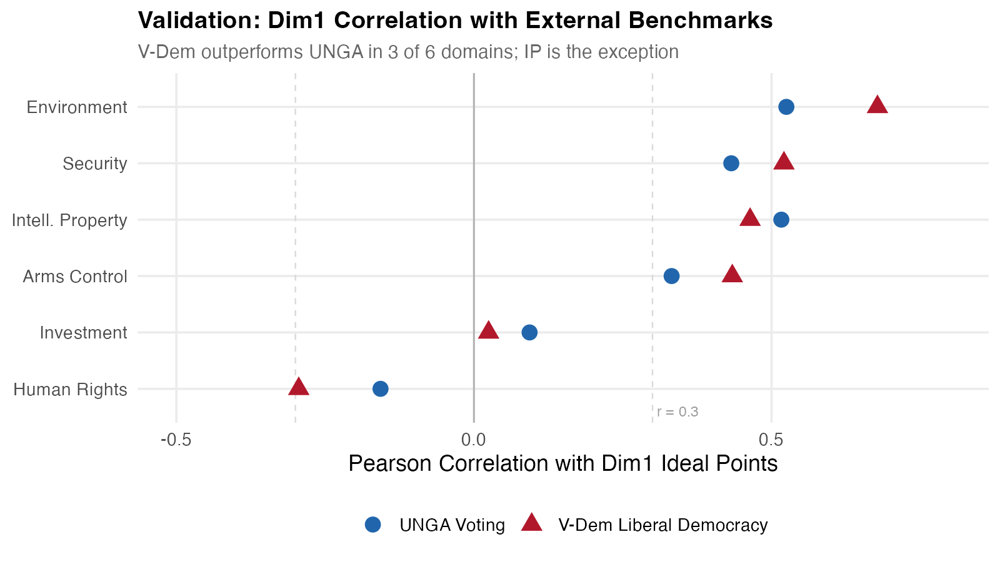
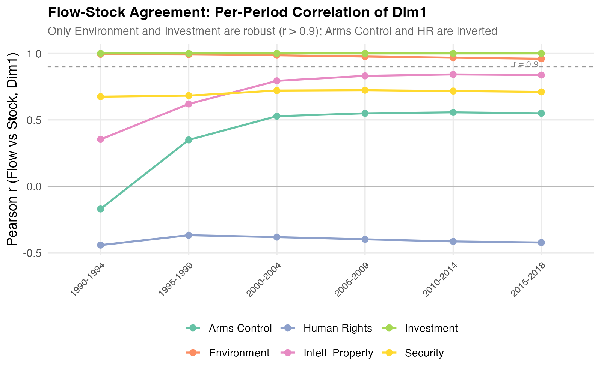
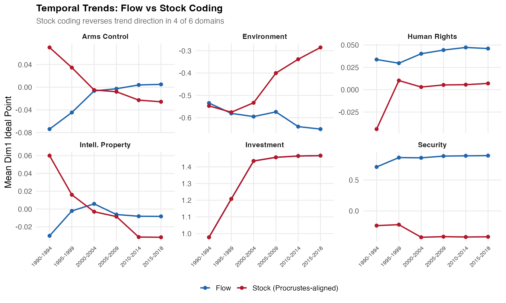
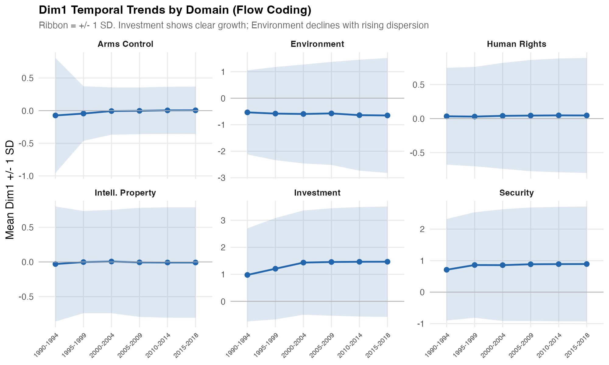

# V7 Block A: 2D Ideal Point Estimation for the International Liberal Order

## What we did

We estimated two-dimensional dynamic ideal points for 203 countries across 6 treaty domains (investment, security, environment, human rights, arms control, intellectual property) over 6 five-year periods (1990--2018). Dimension 1 is anchored to capture support for the International Liberal Order (ILO); Dimension 2 captures a residual confounder axis. We then ran three validation exercises: (1) external validation against UNGA voting and V-Dem liberal democracy scores, (2) a stock-vs-flow coding robustness check, and (3) temporal trend analysis.

## Finding 1: Dim1 tracks liberal democracy more than geopolitical alignment

We correlated each domain's Dim1 ideal points with two external benchmarks: UNGA voting (a measure of geopolitical alignment) and V-Dem's liberal democracy index (a measure of domestic regime type).

In four of six domains, Dim1 shows meaningful alignment with at least one external benchmark (r > 0.3). The surprise is that **V-Dem outperforms UNGA in three domains** (environment, security, arms control), suggesting that treaty participation on Dim1 reflects domestic regime characteristics more than international voting blocs. The exception is intellectual property, where UNGA alignment matters more --- plausibly because IP treaty networks are shaped by geopolitical bargaining (TRIPS, WIPO negotiations) rather than domestic institutions.

Two domains fail validation: **investment** (r ~ 0) follows bilateral economic logic unrelated to either alignment or democracy, and **human rights** shows a puzzling negative correlation with both benchmarks, suggesting Dim1 polarity may be inverted or that the latent dimension captures selective ratification patterns orthogonal to standard liberal-autocratic axes.

## Finding 2: Activity bias is real and consequential

Flow coding records only *newly ratified* treaties per period; stock coding counts *cumulative* participation. If the two coding schemes produce similar ideal points, the results are robust to this measurement choice. If not, temporal trends may be artifacts of coding decisions.

Only **environment** and **investment** are robust (r > 0.9 across all periods). The remaining four domains show substantial divergence, with arms control and human rights producing *negatively correlated* ideal points under flow vs stock coding.

The consequences for temporal trends are stark:

In environment, flow coding shows a declining Dim1 mean while stock coding shows an increase. In security, the two coding schemes produce opposite-signed levels entirely. In arms control, the trend reverses direction. **Only investment --- where stock equals flow (all treaties are single-period) --- is immune.** This means any claim about temporal erosion or growth of ILO support must be qualified by coding choice, at least until further robustness checks resolve which domains have stable substantive interpretations.

## Finding 3: Heterogeneous temporal dynamics across domains

Under flow coding, the six domains show distinct temporal patterns:

- **Investment**: clear growth in mean Dim1 (+0.49) with rising dispersion --- the BIT network expanded rapidly, with increasing polarization between high-participation and low-participation countries.
- **Security**: moderate growth (+0.18) that plateaus after 2000, consistent with post-Cold War NATO/partnership expansion stabilizing.
- **Environment**: slight decline in mean (-0.12) but *strong* increase in dispersion (+0.58) --- environmental treaty participation is becoming more polarized over time.
- **Arms control, human rights, IP**: essentially flat means, with arms control showing decreasing dispersion (convergence) and the others showing mild change.

The key takeaway is that there is **no uniform systemic trend** across domains. Investment and security show ILO-consistent growth; environment shows polarization; the rest are static. Any aggregate "erosion of the liberal order" narrative would be domain-specific rather than systemic.

## Summary

| Finding | Implication |
|---------|------------|
| V-Dem > UNGA in 3/6 domains | Dim1 partly captures domestic liberalism, not purely international alignment |
| 4/6 domains sensitive to stock/flow | Temporal trend claims require robustness qualification |
| No uniform temporal trend | "ILO erosion" is domain-specific, not systemic |
| HR negative validation | Human rights Dim1 needs investigation (polarity or structural issue) |

## Next steps

1. **Alternative anchor sensitivity (R2)** --- verify that results hold under different country anchor choices
2. **Omega sensitivity (R4)** --- vary the evolution variance to test trend robustness
3. **Item anchor sensitivity (R3)** --- constrain anchor item discrimination parameters
4. **Trade domain** --- implement continuous-response IRT on tariff data
